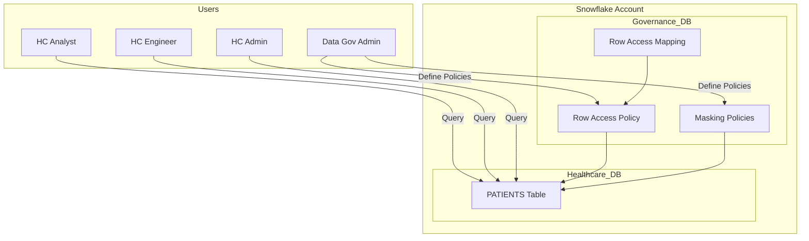
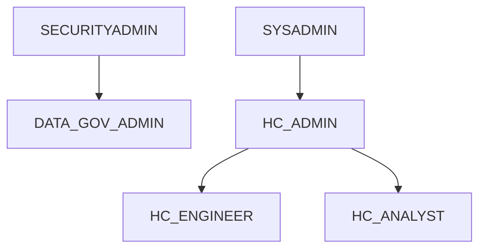

# 🏥 Enterprise-Grade Healthcare Data Governance on Snowflake  
### Secure Multi-Tenant Architecture with RBAC, Row-Level Security & Dynamic Data Masking

> **Designed to mirror real-world enterprise and Big Tech data governance patterns**  
> Built with native Snowflake security primitives — no application-layer enforcement.

---

## 🚀 Executive Summary

This project implements a **production-grade healthcare data governance architecture** on **Snowflake**, demonstrating how sensitive, multi-tenant patient data can be securely managed at scale using **role-based access control, row-level security, and dynamic column masking**.

The system enforces:
- **Who can see which rows**
- **Who can see which values**
- **Who can define governance rules**
  
—all **natively at the data platform layer**, without relying on downstream BI tools or application logic.

This design reflects patterns used in **FAANG / Big Tech data platforms**, especially in regulated domains (Healthcare, FinTech, Identity, Enterprise SaaS).

---

## 🧠 Key Design Principles (Big Tech Lens)

- **Separation of Duties (SoD)**  
  Infrastructure, security, and governance are owned by different roles.
  
- **Policy-Driven Access Control**  
  Access rules are declarative, centralized, and reusable.

- **Zero-Trust Data Access**  
  No implicit trust based on user or application.

- **Scalable Multi-Tenancy**  
  One table, many tenants, zero data leakage.

---

## 🧱 High-Level Architecture






```

| Role               | Responsibility                     |
| ------------------ | ---------------------------------- |
| **SECURITYADMIN**  | Identity & role administration     |
| **SYSADMIN**       | Object creation & infrastructure   |
| **DATA_GOV_ADMIN** | Governance, RLS & masking policies |
| **HC_ADMIN**       | Full healthcare operational access |
| **HC_ENGINEER**    | Engineering & pipeline access      |
| **HC_ANALYST**     | Restricted analytics access        |


```

# 🗂️ Data Model Overview

**Table:** `HEALTHCARE_DB.HEALTHCARE_SCH.PATIENTS`

A global, multi-tenant **patient master table** designed to support healthcare organizations across multiple regions:

- 🇺🇸 **United States**
- 🇪🇺 **European Union**
- 🌏 **APAC**

**Tenant Isolation Key:** `organization_id`

This model is built to enable secure, scalable analytics on sensitive healthcare data while maintaining strict tenant and access isolation.

---

## 🔐 Data Classification

This table contains regulated healthcare data, including:

- **Personally Identifiable Information (PII)**
  - Patient names
  - Email addresses
  - National identifiers

- **Protected Health Information (PHI)**
  - Diagnosis and clinical data

- **Audit Metadata**
  - `created_by`
  - Creation and update timestamps

> ⚠️ All data access must comply with regional data protection regulations (e.g., HIPAA, GDPR).

---

## 🛡️ Governance Capabilities

### 1️⃣ Role-Based Access Control (RBAC)

Access is governed using a hierarchical role-based model:

- Users inherit privileges through **role hierarchy**
- **No direct grants** are applied to individual users
- Enforces **least privilege** by default

✅ Aligned with enterprise-grade IAM and security best practices.

---

### 2️⃣ Row-Level Security (Multi-Tenant Isolation)

Tenant-level data isolation is enforced using:

- **Snowflake Row Access Policies**
- A **centralized governance mapping table** that determines row visibility

This ensures:
- Organizations can only access their own patient records
- Secure multi-tenant analytics without data leakage

---

2️⃣ Row-Level Security (Multi-Tenant Isolation)

Row access is enforced using a Snowflake Row Access Policy backed by a centralized governance mapping table.

CURRENT_ROLE()
   ↓
ROW_ACCESS_MAPPING
   ↓
Allowed organization_id rows

Access Matrix
Role	Accessible Organizations
HC_ADMIN	All tenants
HC_ENGINEER	Multiple tenants
HC_ANALYST	Single tenant

🚫 Analysts cannot query data outside their organization — even with full table SELECT privileges.

3️⃣ Dynamic Column-Level Masking (PII / PHI)

Masking is evaluated at query runtime, based on the active role.

Column	Masking Strategy
First / Last Name	Tokenized hash
Email	Tokenized hash
National ID	Redacted
Diagnosis	Tokenized PHI
Date of Birth	Year-only generalization

Admins see full values.
Analysts see privacy-safe representations.

🧪 Same Query, Different Results
SELECT first_name, email, primary_diagnosis
FROM HEALTHCARE_DB.HEALTHCARE_SCH.PATIENTS;

Role	Output
HC_ADMIN	Full unmasked data
HC_ANALYST	Masked values + restricted rows
DATA_GOV_ADMIN	Full cross-tenant visibility

✔ No views
✔ No WHERE clauses
✔ No application logic

Security is enforced entirely by the platform.

🛠️ Tech Stack

Snowflake

RBAC (Role-Based Access Control)

Row Access Policies (RLS)

Dynamic Data Masking

SQL

Enterprise Data Governance Design

Multi-Tenant Data Architecture

Healthcare Data Security (HIPAA / GDPR-aligned)

🛡️ Compliance & Security Alignment

This architecture supports:

HIPAA — PHI protection

GDPR — data minimization & controlled access

SOC 2 principles

Zero-trust data access models

📈 Scalability & Extensibility

This design can be extended to support:

Attribute-Based Access Control (ABAC)

Time-bound access (contractors, vendors)

Secure data sharing

Audit & lineage tracking

BI tool integration (Tableau, Power BI, Looker)

🎯 Why This Matters to Big Tech

Demonstrates platform-level security thinking

Shows ability to design policy-driven systems

Solves real-world multi-tenant isolation

Uses native cloud data warehouse primitives

Aligns with large-scale, regulated environments
