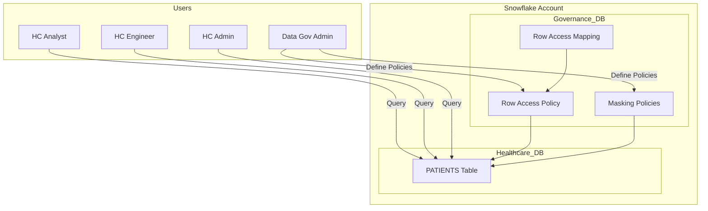
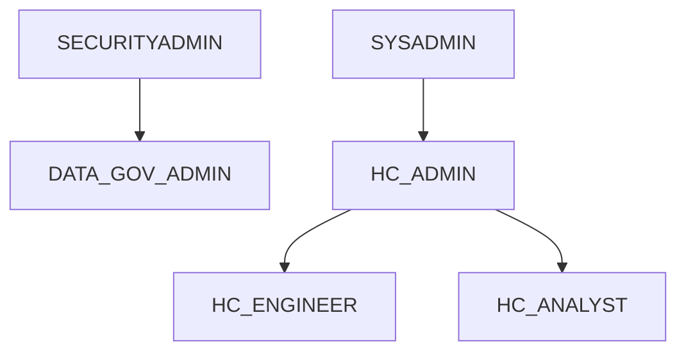

# 🏥 Enterprise-Grade Healthcare Data Governance on Snowflake  
### Secure Multi-Tenant Architecture with RBAC, Row-Level Security & Dynamic Data Masking

> **Designed to mirror real-world enterprise and Big Tech data governance patterns**  
> Built with native Snowflake security primitives — no application-layer enforcement.

---

## 🚀 Executive Summary

This project implements a **production-grade healthcare data governance architecture** on **Snowflake**, demonstrating how sensitive, multi-tenant patient data can be securely managed at scale using **role-based access control, row-level security, and dynamic column masking**.

The system enforces:
- **Who can see which rows**
- **Who can see which values**
- **Who can define governance rules**
  
—all **natively at the data platform layer**, without relying on downstream BI tools or application logic.

This design reflects patterns used in **FAANG / Big Tech data platforms**, especially in regulated domains (Healthcare, FinTech, Identity, Enterprise SaaS).

---

## 🧱 High-Level Architecture

# 🛡️ Data Governance Summary

A cloud-native, enterprise-grade governance framework designed to enforce secure, scalable, and compliant data access using Snowflake’s native capabilities.

---

## 🔐 Role-Based Access Control (RBAC)
- Hierarchical role model with privilege inheritance  
- No direct grants to individual users  
- Enforces least-privilege access by default  
- Aligned with enterprise IAM best practices  

---

## 🧩 Row-Level Security (Multi-Tenant Isolation)
- Implemented using Snowflake Row Access Policies  
- Backed by a centralized governance mapping table  
- Enforces tenant-level data isolation  
- Prevents cross-organization data access, even with broad table privileges  

---

## 🧬 Dynamic Column-Level Masking
- Masking evaluated at query runtime based on the active role  
- Protects PII / PHI without duplicating data  
- Enables privacy-safe analytics without views or application logic  

---

## 🏗️ Platform-Enforced Security
- Security enforced entirely within Snowflake  
- No WHERE clauses  
- No custom views  
- No application-side filtering  

---

## 📜 Compliance-Ready Architecture
Designed to support regulated environments, including:
- HIPAA — PHI protection  
- GDPR — data minimization and controlled access  
- SOC 2 principles  
- Zero-trust data access models  

---

## 📈 Scalable & Extensible Design
- Extendable to Attribute-Based Access Control (ABAC)  
- Supports time-bound access for contractors and vendors  
- Enables secure data sharing  
- Audit logging and data lineage  
- BI tool integration (Tableau, Power BI, Looker)  

---

## 🏢 Enterprise-Grade Governance
- Policy-driven, multi-tenant security design  
- Built using cloud-native data warehouse primitives  
- Designed for scale, compliance, and real-world production workloads  

---

## 🧠 Key Design Principles (Big Tech Lens)

- **Separation of Duties (SoD)**  
  Infrastructure, security, and governance are owned by different roles.
  
- **Policy-Driven Access Control**  
  Access rules are declarative, centralized, and reusable.

- **Zero-Trust Data Access**  
  No implicit trust based on user or application.

- **Scalable Multi-Tenancy**  
  One table, many tenants, zero data leakage.

---

# 🗂️ Data Model Overview

**Table:** `HEALTHCARE_DB.HEALTHCARE_SCH.PATIENTS`

A global, multi-tenant **patient master table** designed to support healthcare organizations across multiple regions:

- 🇺🇸 **United States**
- 🇪🇺 **European Union**
- 🌏 **APAC**

**Tenant Isolation Key:** `organization_id`

This model is built to enable secure, scalable analytics on sensitive healthcare data while maintaining strict tenant and access isolation.

---

## 🔐 Data Classification

This table contains regulated healthcare data, including:

- **Personally Identifiable Information (PII)**
  - Patient names
  - Email addresses
  - National identifiers

- **Protected Health Information (PHI)**
  - Diagnosis and clinical data

- **Audit Metadata**
  - `created_by`
  - Creation and update timestamps

> ⚠️ All data access must comply with regional data protection regulations (e.g., HIPAA, GDPR).

---

